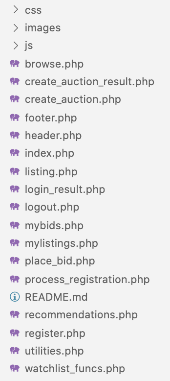

## Mauction

<!--  -->

**What does this application do and why?**

* Mauction operates similarly to eBay.
* Users can sell items or bid on items to purchase.

**How the application is organized**

Mauction is organized into the following files: 



* *README* - this file contains all information about Mauction.

* *images folder* - stores all of the images for this README file.


* *ER Diagram* - this file contains the initial ER Diagram.

**Step-by-Step on how to run the application**

```js
localhost:8888/mauction/browse.php
```

* On the homepage, the user is prompted to sign up or login.

**Technologies Used** 

* PHP
* MAMP
* mySQL Workbench
* SQL
* JavaScript
* jQuery
* Bootstrap
* CSS Grid
* HTML

**Developers**

Arianna Bourke - AriannaBourke

Caroline Crandell - cecrandell

Wei Quan - erinuclkwon

Matthew Shorvon - mattShorvon